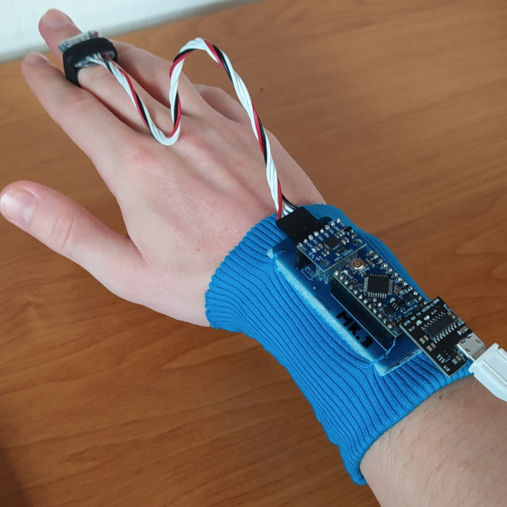

# Atlas One
Gesture detection using gyroscopes and an Arduino. It's a little hobby project I worked on in high school. Paired with the PC terminal it can be used to navigate Windows and do things like switch programs (alt+tab), minimize/maximize windows and scroll.  

  
The idea for this project came from watching _Iron Man_, where Tony Stark could navigate his computers with hand gestures. The name _Atlas_ is completely arbitrary, I just thought it sounds cool.  

## Hardware
I used Arduino Pro Mini 3.3V 8MHz to ease the communication with 3.3V MPU6050s. You can find both a GERBER file as well as a pdf for making you own pcb in `/pcb` directory. Although the final version was made using a professionally made PCB, a diy etched one works just as fine.  

## The future of this project
I might actually revamp this project in the future, potential improvements include:
- making it work on linux, mac and windows
- HID interface with no need for a 'terminal'
- a more powerful version with 6 gyroscopes (one for each finger + one on the back of the hand)
- make it more professional in general (no gestures hardcoding etc.)

## Credits
- [This tutorial video](https://youtu.be/M9lZ5Qy5S2s) by EEEnthusiast on using the MPU6050 with Arduino
- [This paper](https://ds.opdenbrouw.nl/micprg/pdf/serial-win.pdf) on Windows Serial Port Programming - proved useful back when I only knew C++ and still used Windows🤢
- [This kickstarter product](https://www.kickstarter.com/projects/asdffilms/gest-work-with-your-hands) was a huge inspiration as well.