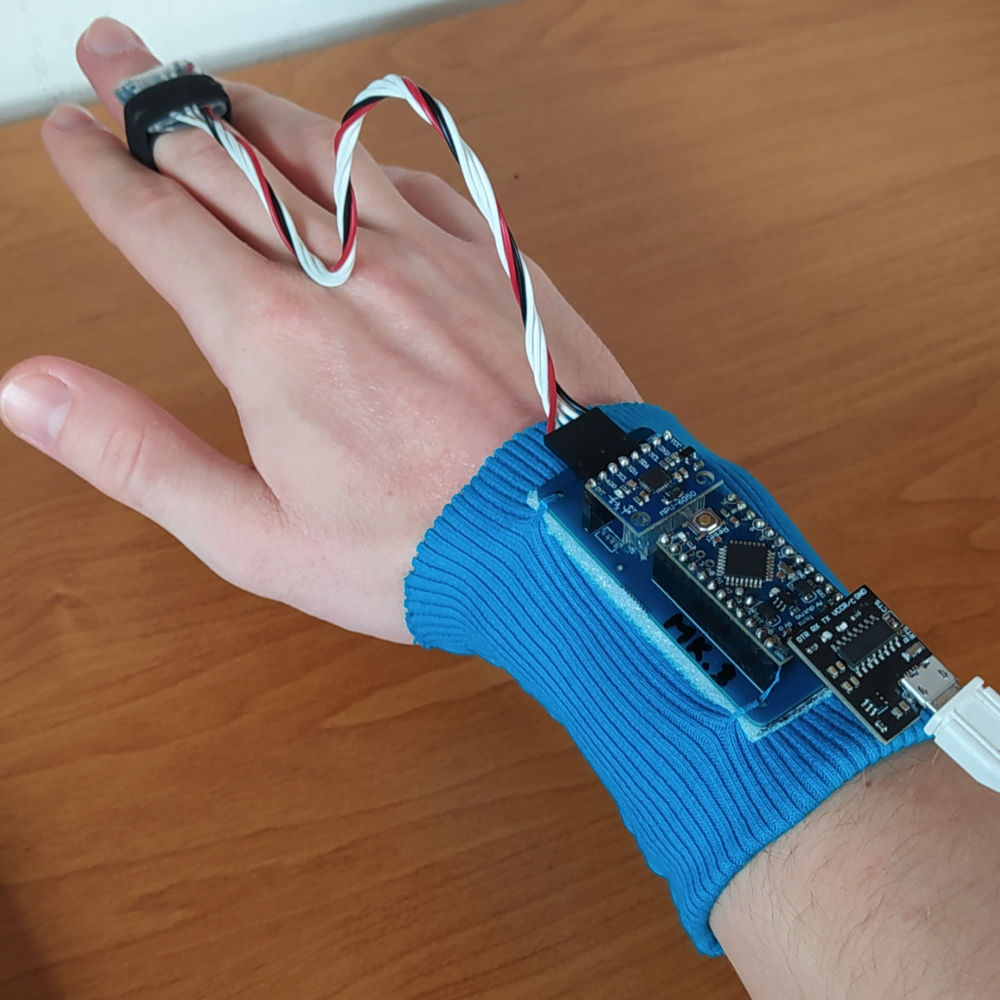

# Atlas One
Simple gest detection using gyroscopes and an Arduino. It's a little hobby project I worked on in high school.  
  
  
The source code is very well documented, you can find all info about how it works there. Check out the credits for resources I found useful.  
  
The idea for this project came from watching _Iron Man_, where Tony Stark could navigate his computers with hand gestures. The name _Atlas_ is completely arbitrary, I just thought it sounds cool.  

## Hardware
I used Arduino Pro Mini 3.3V 8MHz mainly because I worried that any 5V board could have problems with communicating with 3.3V MPUs. Turns out you can use any board you like, the PCB in this repo is designed specifically for said Pro Mini tho. You can find an assembled device photo in this repo.

There's also a pdf with another pcb design for diy pcb. If you want to etch your own pcb in your basement this is the file you're looking for, just print it on a laser printer (ink won't work), etch and connect the two pairs of holes with some wiring.

Be sure to hit me up if you need some more detailed info about this project or have any ideas regarding further development.

## The future of this project
I might actually revamp this project in the future
- make it work on linux, mac and windows
- HID interface, no need for terminal/optional computer software - the issue is, it would require some hardware modifications
- a more powerful version with 6 gyroscopes (one for each finger)
- make it more professional in general (no gestures hardcoding etc)

## Credits
- [This tutorial video](https://youtu.be/M9lZ5Qy5S2s) by EEEnthusiast on using the MPU6050 with Arduino
- [This paper](https://ds.opdenbrouw.nl/micprg/pdf/serial-win.pdf) on Windows Serial Port Programming - proved useful back when I only knew C++ and still used Windows🤢